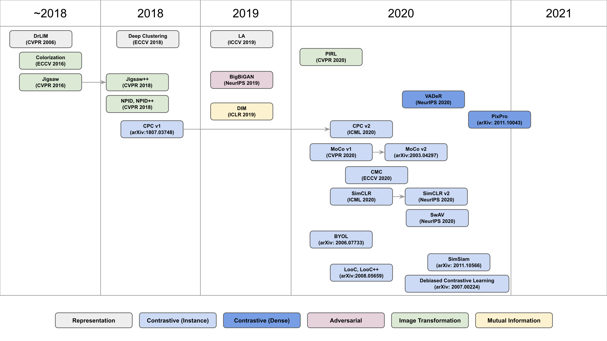

Awesome-Self-Supervised-Papers

Collecting papers about Self-Supervised Learning, Representation Learning.

**Last Update : 2021. 09. 26.**

* Update papers that handles self-supervised learnning with distillation.
  (Seed, Compress, DisCo, DoGo, SimDis ...)
* Add a dense prediction paper (SoCo)

**Any contributions, comments are welcome.**

# Computer Vision (CV)

## Pretraining / Feature / Representation

### Contrastive Learning

| Conference / Journal  | Paper                                                        | ImageNet Acc (Top 1)                                        |
| --------------------- | ------------------------------------------------------------ | ----------------------------------------------------------- |
| CVPR 2006             | [Dimensionality Reduction by Learning an Invariant Mapping](http://yann.lecun.com/exdb/publis/pdf/hadsell-chopra-lecun-06.pdf) | -                                                           |
| arXiv:1807.03748      | [Representation learning with contrastive predictive coding (CPC)](https://arxiv.org/pdf/1807.03748.pdf) | -                                                           |
| arXiv:1911.05722      | [Momentum Contrast for Unsupervised Visual Representation Learning (MoCo)](https://arxiv.org/pdf/1911.05722.pdf) | 60.6 %                                                      |
| arXiv:1905.09272      | [Data-Efficient Image Recognition contrastive predictive coding (CPC v2)](https://arxiv.org/pdf/1905.09272.pdf) | 63.8 %                                                      |
| arXiv:1906.05849      | [Contrastive Multiview Coding (CMC)](https://arxiv.org/pdf/1906.05849.pdf) | 66.2 %                                                      |
| arXiv:2002.05709      | [A Simple Framework for Contrastive Learning of Visual Representations (SimCLR)](https://arxiv.org/pdf/2002.05709.pdf) | 69.3 %                                                      |
| arXiv:2003.12338      | [Improved Baselines with Momentum Contrastive Learning(MoCo v2)](https://arxiv.org/pdf/2003.04297.pdf) | 71.1 %                                                      |
| arXiv:2003.05438      | [Rethinking Image Mixture for Unsupervised Visual Representation Learning](https://arxiv.org/pdf/2003.05438.pdf) | 65.9 %                                                      |
| arXiv:2004.05554      | [Feature Lenses: Plug-and-play Neural Modules for Transformation-Invariant Visual Representations](https://arxiv.org/pdf/2004.05554.pdf) |                                                             |
| arXiv:2006.10029      | [Big Self-Supervised Models are Strong Semi-Supervised Learners(SimCLRv2)](https://arxiv.org/pdf/2006.10029.pdf) | 77.5 % (10% label)                                          |
| arXiv:2006.07733      | [Bootstrap Your Own Latent A New Approach to Self-Supervised Learning](https://arxiv.org/pdf/2006.07733.pdf) | 74.3 %                                                      |
| arXiv:2006.09882      | [Unsupervised Learning of Visual Features by Contrasting Cluster Assignments(SwAV)](https://arxiv.org/pdf/2006.09882.pdf) | 75.3%                                                       |
| arXiv:2008.05659      | [What Should Not Be Contrastive in Contrastive Learning](https://arxiv.org/pdf/2008.05659.pdf) | 80.2 % (ImageNet-100)                                       |
| arXiv:2007.00224      | [Debiased Contrastive Learning](https://arxiv.org/pdf/2007.00224.pdf) | 74.6 % (ImageNet-100)                                       |
| arXiv:2009.00104      | [A Framework For Contrastive Self-Supervised Learning And Designing A New Approach](https://arxiv.org/pdf/2009.00104.pdf) | -                                                           |
| ICLR2021 under review | [SELF-SUPERVISED REPRESENTATION LEARNING VIA ADAPTIVE HARD-POSITIVE MINING](https://openreview.net/pdf?id=aLIbnLY9NtH) | 72.3% (ResNet-50(4x): 77.3%)                                |
| IEEE Access           | [Contrastive Representation Learning: A Framework and Review](https://arxiv.org/pdf/2010.05113.pdf) | review paper                                                |
| arXiv:2010.01929      | [EQCO: EQUIVALENT RULES FOR SELF-SUPERVISED CONTRASTIVE LEARNING](https://arxiv.org/pdf/2010.01929.pdf) | 68.5 % (Proposed) / 66.6 % (SimCLR) / 200epochs             |
| arXiv:2010.01028      | [Hard Negative Mixing for Contrastive Learning](https://arxiv.org/pdf/2010.01028.pdf) | 68.0% / 200epochs                                           |
| arXiv:2011.10566      | [Exploring Simple Siamese Representation Learning(SimSiam)](https://arxiv.org/pdf/2011.10566.pdf) | 68.1% / 100 epochs / 256 batch                              |
| arXiv:2010.06682      | [Are all negatives created equal in contrastive instance discrimination?](https://arxiv.org/pdf/2010.06682.pdf) | -                                                           |
| arXiv:2101.05224      | [Big Self-Supervised Models Advance Medical Image Classification](https://arxiv.org/pdf/2101.05224.pdf) | AUC: 0.7729 (SimCLR / ImagNet--> Chexpert / ResNet-152(2x)) |
| arXiv:2012.08850      | [Contrastive Learning Inverts the Data Generating Process](https://arxiv.org/pdf/2102.08850.pdf?fbclid=IwAR3sw-7IfgbgiIblQPb4Y1OCXKYn0dkcVtri_n8Ln73fgC2vSnPn9HYvi4E) | Theoretical fondation about contrastive learning            |
| arXiv:2103.01988      | [Self-supervised Pretraining of Visual Features in the Wild](https://arxiv.org/pdf/2103.01988.pdf?fbclid=IwAR33zJ9CqxAdL3JJzo0eT2AkmdTpA9_zMc-566flGddOc1HMzESQTdu9piE) | (finetune) 83.8%(693M parameters), 84.2%(1.3B parameters)   |
| arXiv:2103.03230      | [Barlow Twins: Self-Supervised Learning via Redundancy Reduction](https://arxiv.org/pdf/2103.03230.pdf?fbclid=IwAR1p0f_DIdSF1gLFxcdAnBbUX7BO-5AFAqWQea0fNbOCsO5DK3TfQ6xTjo0) | 73.2%                                                       |
| arXiv:2104.02057      | [An Empirical Study of Training Self-Supervised Vision Transformers](https://arxiv.org/pdf/2104.02057.pdf) | 81.0%                                                       |

**Dense Contrastive Learning**

| Conference / Journal             | Paper                                                        | AP(bbox) @COCO | AP(mask) @COCO |
| ---------------- | ------------------------------------------------------------ | --------------------- | ---------------- |
| NeurIPS 2020     | [Unsupervised Learning of Dense Visual Representations](https://arxiv.org/pdf/2011.05499.pdf) | 39.2 | 35.6 |
| arXiv:2011.09157 | [Dense Contrastive Learning for Self-Supervised Visual Pre-Training](https://arxiv.org/pdf/2011.09157.pdf) | 40.3 @COCO | 36.4 |
| arXiv:2011.10043 | [Propagate Yourself: Exploring Pixel-Level Consistency for Unsupervised Visual Representation Learning](https://arxiv.org/pdf/2011.10043.pdf) | 41.4 | 37.4 |
| arXiv:2102.08318 | [Instance Localization for Self-supervised Detection Pretraining](https://arxiv.org/pdf/2102.08318.pdf) | 42.0 | 37.6 |
| arXiv:2103.06122 | [Spatially Consistent Representation Learning](https://arxiv.org/pdf/2103.06122.pdf) | 41.3 | 37.7 |
| arXiv:2103.10957 | [Efficient Visual Pretraining with Contrastive Detection](https://arxiv.org/pdf/2103.10957.pdf) | 42.7 (DetCon_B) | 38.2 (DetCon_B) |
| arXiv:2106.02637 | [Aligning Pretraining for Detection via Object-Level Contrastive Learning](https://arxiv.org/pdf/2106.02637.pdf) | 43.2 | 38.4 |

### Image Transformation

| Conference / Journal | Paper                                                        | ImageNet Acc (Top 1).      |
| -------------------- | ------------------------------------------------------------ | -------------------------- |
| ECCV 2016            | [Colorful image colorization(Colorization)](https://arxiv.org/pdf/1603.08511.pdf) | 39.6%                      |
| ECCV 2016            | [Unsupervised learning of visual representations by solving jigsaw puzzles](https://arxiv.org/pdf/1603.09246.pdf) | 45.7%                      |
| CVPR 2018            | [Unsupervised Feature Learning via Non-Parametric Instance Discrimination (NPID, NPID++)](https://openaccess.thecvf.com/content_cvpr_2018/CameraReady/0801.pdf) | NPID: 54.0%, NPID++: 59.0% |
| CVPR 2018            | [Boosting Self-Supervised Learning via Knowledge Transfer (Jigsaw++)](https://openaccess.thecvf.com/content_cvpr_2018/papers/Noroozi_Boosting_Self-Supervised_Learning_CVPR_2018_paper.pdf) | -                          |
| CVPR 2020            | [Self-Supervised Learning of Pretext-Invariant Representations (PIRL)](https://arxiv.org/pdf/1912.01991.pdf) | 63.6 %                     |
| CVPR 2020            | [Steering Self-Supervised Feature Learning Beyond Local Pixel Statistics](https://arxiv.org/pdf/2004.02331.pdf) | -                          |
| arXiv:2003.04298     | [Multi-modal Self-Supervision from Generalized Data Transformations](https://arxiv.org/pdf/2003.04298.pdf) | -                          |

### Self-supervised learning with Knowledge Distillation 

| Conference / Journal | Paper                                                        | Method                                                  |
| -------------------- | ------------------------------------------------------------ | ------------------------------------------------------- |
| NeurIPS 2020         | [CompRess: Self-Supervised Learning by Compressing Representations](https://arxiv.org/pdf/2010.14713.pdf) | Similarity Distribution + Memory bank                   |
| ICLR 2021            | [SEED: SELF-SUPERVISED DISTILLATION FOR VISUAL REPRESENTATION](https://arxiv.org/pdf/2101.04731.pdf) | Similarity Distribution + Memory bank                   |
| arXiv:2104.09124     | [DisCo: Remedy Self-supervised Learning on Lightweight Models with Distilled Contrastive Learning](https://arxiv.org/pdf/2104.09124v3.pdf) | Contrastive Learning w/ Teacher Model                   |
| arXiv:2104.09866     | [Distill on the Go: Online knowledge distillation in self-supervised learning](https://arxiv.org/pdf/2104.09866.pdf) | Contrastive Learnning w/ Teacher Model                  |
|arXiv:2104.14294 | [Emerging Properties in Self-Supervised Vision Transformers](https://arxiv.org/pdf/2104.14294.pdf) | Self Distillation w/ Teacher Model|
| ICLR 2022 | [iBOT: Image BERT Pre-Training with Online Tokenizer](https://arxiv.org/pdf/2111.07832.pdf) | Self Distillation w/ Teacher Model + Masked Image Modeling|
| arXiv:2106.11304     | [Simple Distillation Baselines for Improving Small Self-supervised Models](https://arxiv.org/pdf/2106.11304.pdf) | Contrastive Learning w/ Teacher Model + Multi-view loss |
| arXiv:2107.01691     | [Bag of Instances Aggregation Boosts Self-supervised Learning](https://arxiv.org/pdf/2107.01691.pdf) | Bag aggregation                                         |

### Others (in Pretraining / Feature / Representation)

| Conference / Journal   | Paper                                                        | Method                       |
| ---------------------- | ------------------------------------------------------------ | ---------------------------- |
| ICLR2018               | [Unsupervised Representation Learning by Predicting Image Rotations](https://arxiv.org/abs/1803.07728)  | Surrogate classes, pre-training
| ICML 2018              | [Mutual Information Neural Estimation](https://arxiv.org/pdf/1801.04062.pdf) | Mutual Information           |
| NeurIPS 2019           | [Wasserstein Dependency Measure for Representation Learning](http://papers.nips.cc/paper/9692-wasserstein-dependency-measure-for-representation-learning.pdf) | Mutual Information           |
| ICLR 2019              | [Learning Deep Representations by Mutual Information Estimation and Maximization](https://arxiv.org/pdf/1808.06670.pdf) | Mutual Information           |
| arXiv:1903.12355       | [Local Aggregation for Unsupervised Learning of Visual Embeddings](https://arxiv.org/pdf/1903.12355.pdf) | Local Aggregation            |
| arXiv:1906.00910       | [Learning Representations by Maximizing Mutual Information Across Views](https://arxiv.org/pdf/1906.00910.pdf) | Mutual Information           |
| arXiv:1907.02544       | [Large Scale Adversarial Representation Learning(BigBiGAN)](https://arxiv.org/pdf/1907.02544.pdf) | Adversarial Training         |
| ICLR 2020              | [On Mutual Information Maximization for Representation Learning](https://arxiv.org/pdf/1907.13625.pdf) | Mutual Information           |
| CVPR 2020              | [How Useful is Self-Supervised Pretraining for Visual Tasks?](https://arxiv.org/pdf/2003.14323.pdf) | -                            |
| CVPR 2020              | [Adversarial Robustness: From Self-Supervised Pre-Training to Fine-Tuning](https://arxiv.org/pdf/2003.12862.pdf) | Adversarial Training         |
| ICLR 2020              | [Self-Labeling via Simultaneous Clustering and Representation Learning](https://arxiv.org/pdf/1911.05371.pdf) | Information                  |
| arXiv:1912.11370       | [Big Transfer (BiT): General Visual Representation Learning](https://arxiv.org/pdf/1912.11370.pdf) | pre-training                 |
| arXiv:2009.07724       | [Evaluating Self-Supervised Pretraining Without Using Labels](https://arxiv.org/pdf/2009.07724.pdf) | pre-training                 |
| arXiv:2010.00578       | [UNDERSTANDING SELF-SUPERVISED LEARNING WITH DUAL DEEP NETWORKS](https://arxiv.org/pdf/2010.00578.pdf) | Dual Deep Network            |
| ICLR 2021 under review | [REPRESENTATION LEARNING VIA INVARIANT CAUSAL MECHANISMS](https://arxiv.org/pdf/2010.07922.pdf) | Casual mechanism             |
| arXiv:2006.06882       | [Rethinking Pre-training and Self-training](https://arxiv.org/pdf/2006.06882.pdf) | Rethinking                   |
| arXiv:2102.12903       | [Self-Tuning for Data-Efficient Deep Learning](https://arxiv.org/pdf/2102.12903.pdf) | Data-efficient deep learning |
| arXiv:2102.10106       | [Mine Your Own vieW: Self-Supervised Learning Through Across-Sample Prediction](https://arxiv.org/pdf/2102.10106.pdf) | Find similar samples         |
| ECCV 2020              | [Mitigating Embedding and Class Assignment Mismatch in Unsupervised Image Classification](https://www.ecva.net/papers/eccv_2020/papers_ECCV/papers/123690749.pdf) | Feature embedding & refining |
| arXiv:2102.11150       | [Improving Unsupervised Image Clustering With Robust Learning](https://arxiv.org/pdf/2012.11150.pdf) | Pseudo-label, clustering     |
| CVPR 2021              | [How Well Do Self-Supervised Models Transfer?](https://arxiv.org/abs/2011.13377) | Benchmarking     | 

## Identification / Verification / Classification / Recognition

| Conference / Journal | Paper                                                        | Datasets   | Performance         |
| -------------------- | ------------------------------------------------------------ | ---------- | ------------------- |
| CVPR 2020            | [Real-world Person Re-Identification via Degradation Invariance Learning](https://arxiv.org/pdf/2004.04933.pdf) | MLR-CHUK03 | Acc : 85.7(R@1)     |
| CVPR 2020            | [Spatially Attentive Output Layer for Image Classification](https://arxiv.org/pdf/2004.07570.pdf) | ImageNet   | Acc : 81.01 (Top-1) |
| CVPR 2020            | [Look-into-Object: Self-supervised Structure Modeling for Object Recognition](https://arxiv.org/pdf/2003.14142.pdf) | ImageNet   | Top-1 err : 22.87   |

## Segmentation / Depth Estimation

| Conference / Journal | Paper                                                        | Datasets        | Performance     |
| -------------------- | ------------------------------------------------------------ | --------------- | --------------- |
| CVPR 2020            | [Self-supervised Equivariant Attention Mechanism for Weakly Supervised Semantic Segmentation](https://arxiv.org/pdf/2004.04581.pdf) | VOC 2012        | mIoU : 64.5     |
| CVPR 2020            | [Towards Better Generalization: Joint Depth-Pose Learning without PoseNet](https://arxiv.org/pdf/2004.01314.pdf) | KITTI 2015      | F1 : 18.05 %    |
| IROS 2020            | [Monocular Depth Estimation with Self-supervised Instance Adaptation](https://arxiv.org/pdf/2004.05821.pdf) | KITTI 2015      | Abs Rel : 0.074 |
| CVPR 2020            | [Novel View Synthesis of Dynamic Scenes with Globally Coherent Depths from a Monocular Camera](https://arxiv.org/pdf/2004.01294.pdf) | -               | -               |
| CVPR 2020            | [Unsupervised Intra-domain Adaptation for Semantic Segmentation through Self-Supervision](https://arxiv.org/pdf/2004.07703.pdf) | GTA5->Cityscape | mIoU : 46.3     |
| CVPR 2020            | [D3VO : Deep Depth, Deep Pose and Deep Uncertainty for Monocular Visual Odometry](https://arxiv.org/pdf/2003.01060.pdf) | -               | -               |
| CVPR 2020            | [Self-Supervised Human Depth Estimation from Monocular Videos](https://arxiv.org/pdf/2005.03358.pdf) | -               | -               |
| arxiv:2009.07714     | [Calibrating Self-supervised Monocular Depth Estimation](https://arxiv.org/pdf/2009.07714.pdf) | KITTI           | Abs Rel: 0.113  |

## Detection / Localization

| Conference / Journal | Paper                                                        | Datsets  | Performance   |
| -------------------- | ------------------------------------------------------------ | -------- | ------------- |
| CVPR 2020            | [Instance-aweare, Context-focused, and Memory-efficient Weakly Supervised Object Detection](https://arxiv.org/pdf/2004.04725.pdf) | VOC 2012 | AP(50) : 67.0 |

## Generation

| Conference / Journal         | Paper                                                        | Task                            |
| ---------------------------- | ------------------------------------------------------------ | ------------------------------- |
| CVPR 2020                    | [StyleRig: Rigging StyleGAN for 3D Control over Portrait Images](https://arxiv.org/pdf/2004.00121.pdf) | Portrait Images                 |
| ICLR 2020                    | [From Inference to Generation: End-to-End Fully Self-Supervised Generation of Human Face from Speech](https://arxiv.org/pdf/2004.05830.pdf) | Generate human face from speech |
| ACMMM2020                    | [Neutral Face Game Character Auto-Creation via PokerFace-GAN](https://arxiv.org/pdf/2008.07154.pdf) |                                 |
| ICLR 2021  under review | [Self-Supervised Variational Auto-Encoders](https://arxiv.org/pdf/2010.02014.pdf) | FID: 34.71 (CIFAR-10)           |

## Video

| Conference / Journal | Paper                                                        | Task                    | Performance                    | Datasets   |
| -------------------- | ------------------------------------------------------------ | ----------------------- | ------------------------------ | ---------- |
| TPAMI                | [A Review on Deep Learning Techniques for Video Prediction](https://arxiv.org/pdf/2004.05214.pdf) | Video prediction review | -                              | -          |
| CVPR 2020            | [Distilled Semantics for Comprehensive Scene Understanding from Videos](https://arxiv.org/pdf/2003.14030.pdf) | Scene Understanding     | Sq Rel : 0.748                 | KITTI 2015 |
| CVPR 2020            | [Self-Supervised Learning of Video-Induced Visual Invariances](https://arxiv.org/pdf/1912.02783.pdf) | Representation Learning | -                              | -          |
| ECCV 2020            | [Video Representation Learning by Recognizing Temporal Transformations](https://arxiv.org/pdf/2007.10730.pdf) | Representation Learning | 26.1 % (Video Retrieval Top-1) | UCF101     |
| arXiv:2008.02531     | [Self-supervised Video Representation Learning Using Inter-intra Contrastive Framework](https://arxiv.org/pdf/2008.02531.pdf) | Representation Learning | 42.4 % (Video Retrieval Top-1) | UCF101     |
| NeurIPS 2020         | [Space-Time Correspondence as a Contrastive Random Walk](https://proceedings.neurips.cc/paper/2020/file/e2ef524fbf3d9fe611d5a8e90fefdc9c-Paper.pdf) | Contrastive Learning    | 64.8 (Region Similarity)       | DAVIS 2017 |

## Others

| Conference / Journal  | Paper                                                        | Task                                             | Performance                              |
| --------------------- | ------------------------------------------------------------ | ------------------------------------------------ | ---------------------------------------- |
| CVPR 2020             | [Flow2Stereo: Effective Self-Supervised Learning of Optical Flow and Stereo Matching](https://arxiv.org/pdf/2004.02138.pdf) | Optical Flow                                     | F1 : 7.63% (KITTI 2012)                  |
| CVPR 2020             | [Self-Supervised Viewpoint Learning From Image Collections](https://arxiv.org/pdf/2004.01793.pdf) | Viewpoint learning                               | MAE : 4.0 (BIWI)                         |
| CVPR 2020             | [Self-Supervised Scene De-occlusion](https://arxiv.org/pdf/2004.02788.pdf) | Remove occlusion                                 | mAP : 29.3 % (KINS)                      |
| CVPR 2020             | [Distilled Semantics for Comprehensive Scene Understanding from Videos](https://arxiv.org/pdf/2003.14030.pdf) | Scene Understanding                              | -                                        |
| CVPR 2020             | [Learning by Analogy : Reliable Supervision from Transformations for Unsupervised Optical Flow Estimation](https://arxiv.org/pdf/2003.13045.pdf) | Optical Flow                                     | F1 : 11.79% (KITTI 2015)                 |
| CVPR 2020             | [D3Feat: Joint Learning of Dense Detection and Description of 3D Local Features](https://arxiv.org/pdf/2003.03164.pdf) | 3D Local Features                                | -                                        |
| CVPR 2020             | [SpeedNet: Learning the Speediness in Videos](https://arxiv.org/pdf/2004.06130.pdf) | predict the "speediness"                         | -                                        |
| CVPR 2020             | [Action Segmentation with Joint Self-Supervised Temporal Domain Adaptation](https://arxiv.org/pdf/2003.02824.pdf) | Action Segmentation                              | F1@10 : 83.0 (GTEA)                      |
| CVPR 2020             | [MVP: Unified Motion and Visual Self-Supervised Learning for Large-Scale Robotic Navigation](https://arxiv.org/pdf/2003.00667.pdf) | Robotic Navigation                               | -                                        |
| arXiv:2003.06734      | [Active Perception and Representation for Robotic Manipulation](https://arxiv.org/pdf/2003.06734.pdf) | Robot manipulation                               | -                                        |
| arXiv:2005.01655      | [Words aren’t enough, their order matters: On the Robustness of Grounding Visual Referring Expressions](https://arxiv.org/pdf/2005.01655.pdf) | Visual Referring Expressions                     | -                                        |
| arXiv:2004.11362      | [Supervised Contrastive Learning](https://arxiv.org/pdf/2004.11362.pdf) | Supervised Contrastive Learning                  | ImageNet Acc: 80.8 (Top-1)               |
| arXiv:2007.14449      | [Learning from Scale-Invariant Examples for Domain Adaptation in Semantic Segmentation](https://arxiv.org/pdf/2007.14449.pdf) | Domain Adaptation                                | GTA5 to Cityscape : 47.5 (mIoU)          |
| arXiv:2007.12360      | [On the Effectiveness of Image Rotation for Open Set Domain Adaptation](https://arxiv.org/pdf/2007.12360.pdf) | Domain Adaptation                                | -                                        |
| arXiv:2003.12283      | [LIMP: Learning Latent Shape Representations with Metric Preservation Priors](https://arxiv.org/pdf/2003.12283.pdf) | Geneartive models                                | -                                        |
| arXiv:2004.04312      | [Learning to Scale Multilingual Representations for Vision-Language Tasks](https://arxiv.org/pdf/2004.04312.pdf) | Vision-Language                                  | MSCOCO: 81.5                             |
| arXiv:2003.08934      | [NeRF: Representing Scenes as Neural Radiance Fields for View Synthesis](https://arxiv.org/pdf/2003.08934.pdf) | View Synthesis                                   | -                                        |
| arXiv:2001.01536      | [Learning From Multiple Experts: Self-paced Knowledge Distillation for Long-tailed Classification](https://arxiv.org/pdf/2001.01536.pdf) | Knowledge Distillation, Long-tail classification | -                                        |
| arXiv:2006.07114      | [Knowledge Distillation Meets Self-Supervision](https://arxiv.org/pdf/2006.07114.pdf) | Knowledge Distillation                           | Res50 --> MobileNetv2 Acc: 72.57 (Top-1) |
| AAAI2020              | [Fast and Robust Face-to-Parameter Translation for Game Character Auto-Creation](https://arxiv.org/pdf/2008.07132.pdf) | Game Character Auto-Creation                     | -                                        |
| arXiv:2009.07719      | [Domain-invariant Similarity Activation Map Metric Learning for Retrieval-based Long-term Visual Localization](https://arxiv.org/pdf/2009.07719.pdf) | Similarity Activation Map                        | -                                        |
| arXiv:2008.10312      | [Self-Supervised Learning for Large-Scale Unsupervised Image Clustering](https://arxiv.org/pdf/2008.10312.pdf) | Image Clustering                                 | ImageNet Acc: 38.60 (cluster assignment) |
| ICLR2021 under review | [SSD: A UNIFIED FRAMEWORK FOR SELFSUPERVISED OUTLIER DETECTION](https://openreview.net/pdf?id=v5gjXpmR8J) | Outlier Detection                                | CIFAR10/CIFAR100 : 94.1% (in/out)        |

# Natural Language Processing (NLP)

| Conference / Journal | Paper                                                        | Datasets | Performance             |
| -------------------- | ------------------------------------------------------------ | -------- | ----------------------- |
| arXiv:2004.03808     | [Improving BERT with Self-Supervised Attention](https://arxiv.org/pdf/2004.03808.pdf) | GLUE     | Avg : 79.3 (BERT-SSA-H) |
| arXiv:2004.07159     | [PALM: Pre-training an Autoencoding&Autoregressive Language Model for Context-conditioned Generation](https://arxiv.org/pdf/2004.07159.pdf) | MARCO    | 0.498 (Rouge-L)         |
| ACL 2020             | [TriggerNER: Learning with Entity Triggers as Explanations for Named Entity Recognition](https://arxiv.org/pdf/2004.07493.pdf) | -        | -                       |
| arXiv:1909.11942     | [ALBERT: A Lite BERT For Self-Supervised Learning of Language Representations](https://arxiv.org/pdf/1909.11942.pdf) | GLUE     | Avg : 89.4              |
| AAAI 2020            | [Learning to Compare for Better Training and Evaluation of Open Domain Natural Language Generation Models](https://arxiv.org/pdf/2002.05058.pdf) | -        | -                       |
| ACL 2020             | [Contrastive Self-Supervised Learning for Commonsense Reasoning](https://arxiv.org/pdf/2005.00669.pdf) | PDP-60   | 90.0%                   |

# Speech 

| Conference / Journal | Paper                                                        | Datasets    | Performance            |
| -------------------- | ------------------------------------------------------------ | ----------- | ---------------------- |
| arXiv:1910.05453v3   | [VQ-WAV2VEC: SELF-SUPERVISED LEARNING OF DISCRETE SPEECH REPRESENTATIONS](https://arxiv.org/pdf/1910.05453.pdf) | nov92       | WER : 2.34             |
| arXiv:1911.03912v2   | [EFFECTIVENESS OF SELF-SUPERVISED PRE-TRAINING FOR SPEECH RECOGNITION](https://arxiv.org/pdf/1911.03912.pdf) | Librispeech | WER : 4.0              |
| ICASSP 2020          | [Generative Pre-Training for Speech with Augoregressive Predictive Coding](https://arxiv.org/pdf/1910.12607.pdf) | -           | -                      |
| Interspeech 2020     | [Jointly Fine-Tuning “BERT-like” Self Supervised Models to Improve Multimodal Speech Emotion Recognition](https://arxiv.org/pdf/2008.06682.pdf) | IEMOCAP     | Emotion Acc: 75.458(%) |

## Graph

| Conference / Journal | Paper                                                        | Datasets               | Performance              |
| -------------------- | ------------------------------------------------------------ | ---------------------- | ------------------------ |
| arXiv:2009.05923     | [Contrastive Self-supervised Learning for Graph Classification](https://arxiv.org/pdf/2009.05923.pdf) | PROTEINS               | A3-specific:85.80        |
| arXiv:2102.13085     | [Towards Robust Graph Contrastive Learning](https://arxiv.org/pdf/2102.13085.pdf) | Cora, Citeseer, Pubmed | Acc: 82.4 (Cora, GCA-DE) |
|                      |                                                              |                        |                          |

## Reinforcement Learning

| Conference / Journal | Paper                                                        | Performance                                          |
| -------------------- | ------------------------------------------------------------ | ---------------------------------------------------- |
| arxiv:2009.05923     | [CONTRASTIVE BEHAVIORAL SIMILARITY EMBEDDINGS FOR GENERALIZATION IN REINFORCEMENT LEARNING](https://arxiv.org/pdf/2101.05265.pdf) | BiC-catch: 821±17 (Random Initialization / DrQ+PSEs) |
|                      |                                                              |                                                      |
|                      |                                                              |                                                      |

